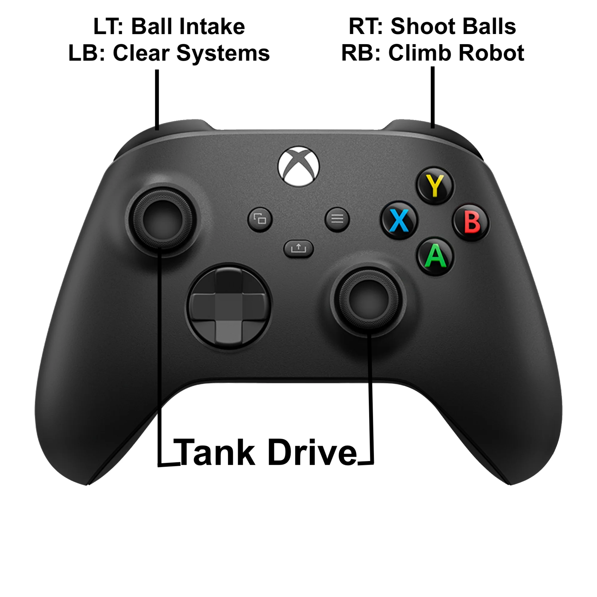

# Rebuilt2026

## Description
Ontario Tech RI3D code repository for the 2026 FIRST Robotics Competition, Rebuilt! All of the code for the robot is in the [`src\main\java\frc\robot`](https://github.com/otri3d/Rebuilt2026/tree/main/src/main/java/frc/robot) folder, everything else is generated by the WPILib application.

We also have time based robot code! This time based code is under a single file called [`TimeBased.java`](https://github.com/otri3d/Rebuilt2026/blob/kersh/src/main/java/frc/robot/TimeBased.java) found in the [`src\main\java\frc\robot`](https://github.com/otri3d/Rebuilt2026/tree/main/src/main/java/frc/robot) folder.

## Controls
To control our robot, we used an [Xbox One Controller](#Xbox-Controls) for all operations.

### Xbox Controls


## Subsystems
These are the subsystems that we implemented to make our robot work. These can be found in the [`subsystems`](https://github.com/otri3d/Rebuilt2026/tree/main/src/main/java/frc/robot/subsystems) folder.

### Drive Subsystem
The drive subsystem is what makes the drivetrain motors move. We use 4 [Neo Brushless](https://www.revrobotics.com/rev-21-1650/) motors with [Spark Max](https://www.revrobotics.com/rev-11-2158/) motor controllers. The motor controllers have the leader/follower role and the inverted state set in the firmware. As methods were being deprecated we leaned towards the more concrete ways of doing it. 

#### Left Side


#### Right Side


### Intake Subsystem
The intake subsystem is what controls floor pick up mechanisim. There are 2 [`insert motor`]() motors controlled by [Spark Max](https://www.revrobotics.com/rev-11-2158/) motor controllers intaking the fuel. We have 1 of the motor controller set in a follow state, leading to only referencing a single motor controller in code. Since these motors are setup on the same side we do not need one of them to be inverted.

### Shooter Subsystem
The shooter subsystem has 2 motors. The left Motor (Leader) and the right motor (follower). Note this MUST be setup throught in REV hardware client where the right motor is inverted and follows the left motor. When motors are powered, the shooter shoots the fuel.

### Climber Subsystem

## Commands
These are the commands that we implemented to make our robot work. These can be found in the [`commands`](https://github.com/otri3d/Rebuilt2026/tree/main/src/main/java/frc/robot/commands) folder.

### Move Command
Move Command operates the [Drive Subsystem](#drive-subsystem). This command is set as a default command, continuously updating the speed of the motors to match the position of the joystick values.
```
// Called every time the scheduler runs while the command is scheduled.
@Override
public void execute() { 
    // ... Deadband code

    // Call the drive subsystem to move
    m_DriveSubsystem.Move(leftY, rightX);
}
```
We noticed that our controllers had some stick drive, to prevent the motors from moving as a result of these small values we apply a deadband. This is just inserted right before the move command 
```
// FRC Driver Station can show live values and the highest idle distance when we want zero is 0.09 
double leftY = MathUtil.applyDeadband(v_forwardSpeed.getAsDouble(), 0.09);
double rightX = MathUtil.applyDeadband(v_rotateSpeed.getAsDouble(), 0.09);
```

### Intake Fuel Command
Intake Fuel Command operates the [Intake Subsystem](#intake-subsystem). We want this command to run while a button is pressed. So the only changes occur when it starts and ends. This is why we have the 
```
@Override
public void execute() { }
```
blank. We have a method to turn on the motor in the inital and a method to stop the motor in the end.
```
@Override
public void initialize() {
    // Call the drive subsystem to move
    m_subsystem.IntakeFuel();
}

// Called once the command ends or is interrupted.
@Override
public void end(boolean interrupted) {
    // Since it ended we want to stop the intake
    m_subsystem.StopMotor();
}
```

### Clear System Command
Clear Systsem Command operates the [Shooter Subsystem](#shooter-subsystem) and the [Intake Subsystem](#intake-subsystem). Each subsystem has a method to run their motors in reverse, so we simply call each of them. This is another case of running while a button is pressed so we just set motor speeds in the intal and end method.
```
// Called when the command is initially scheduled.
@Override
public void initialize() {
    // Call the intake to run in reverse
    m_intakeSubsystem.StuckFuel();

    // Call the shooter to run in reverse
    m_shooterSubsystem.StuckFuel();
}

// Called once the command ends or is interrupted.
@Override
public void end(boolean interrupted) {
    // Since it ended we want to stop the intake
    m_intakeSubsystem.StopMotor();
    m_shooterSubsystem.StopMotor();
}
```
